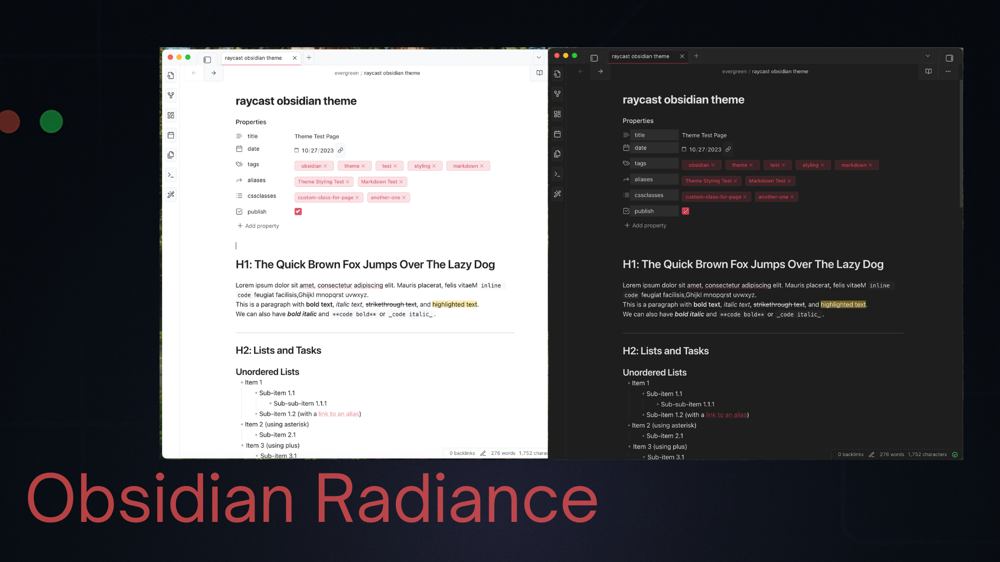

# Raycast for Obsidian

A sleek, modern Obsidian theme inspired by the Raycast macOS application. This theme provides a clean, minimalist interface with carefully crafted UI elements and a signature red accent color that gives your notes a distinctive and professional appearance.

> **Note:** This is an unofficial theme and is not affiliated with or endorsed by Raycast. It was created as a personal project inspired by the Raycast design aesthetic.

## Features

- **Clean, modern interface** inspired by Raycast and Obsidian Minimal
- **Complete dark and light mode** support with carefully selected color palettes
- **Custom styling** for all major UI components:
  - Workspace and sidebars
  - Command palette (Raycast-inspired design)
  - Buttons and interactive elements
  - Modals and prompts
  - Tags and metadata
- **Beautiful typography** using Inter for UI and SFMono for code blocks
- **Elegant accent color** (#d04255) consistently applied throughout the interface
- **Refined UI elements** with consistent spacing, borders, and hover states
- **Improved tag styling** with pill-shaped design in both editor and preview modes

## Installation

### Method 1: From Obsidian Community Themes

1. Open Obsidian Settings
2. Navigate to Appearance → Themes
3. Click "Manage" button
4. Search for "Raycast"
5. Click "Install and use"

### Method 2: Manual Installation

1. Download the `theme.css` and `manifest.json` files
2. Create a new folder called `Raycast` in your vault's `.obsidian/themes/` directory
3. Place the downloaded files in this folder
4. Open Obsidian Settings → Appearance → Themes and select "Raycast"

## Color Scheme

The theme features two carefully designed color schemes:

### Light Mode
- Clean white background (`#ffffff`)
- Subtle secondary backgrounds (`#f8f9fa`)
- Dark text (`#202124`) for optimal readability
- Red accent color (`#d04255`) for interactive elements

### Dark Mode
- Deep dark background (`#1e1e1e`)
- Slightly lighter secondary surfaces (`#252525`)
- Light text (`#e0e0e0`) with proper contrast
- The same signature red accent (`#d04255`) for visual consistency

## Typography

- **UI Font**: Inter with system font fallbacks
- **Monospace Font**: SFMono-Regular with system monospace fallbacks
- Optimized font weights and line heights for readability
- Carefully sized headings with proper spacing

## CSS Structure

The theme's CSS is organized into logical sections:

1. **Variables** - Comprehensive set of CSS custom properties for colors, fonts, spacing
2. **Base Styles** - Fundamental styling for basic elements (links, headings, code blocks)
3. **UI Elements** - Styling for buttons, inputs, scrollbars
4. **Obsidian Specific Styling** - Workspace, sidebars, editor, and other Obsidian components

All styles use CSS variables for consistency and to support potential future customization options.

## Acknowledgements

- Inspired by the [Raycast](https://raycast.com/) macOS application
- Takes influence from the Obsidian Minimal theme

## Support

If you enjoy this theme, consider supporting its development:

## License

MIT License © 2025 Payton Dennis (@jabarid)